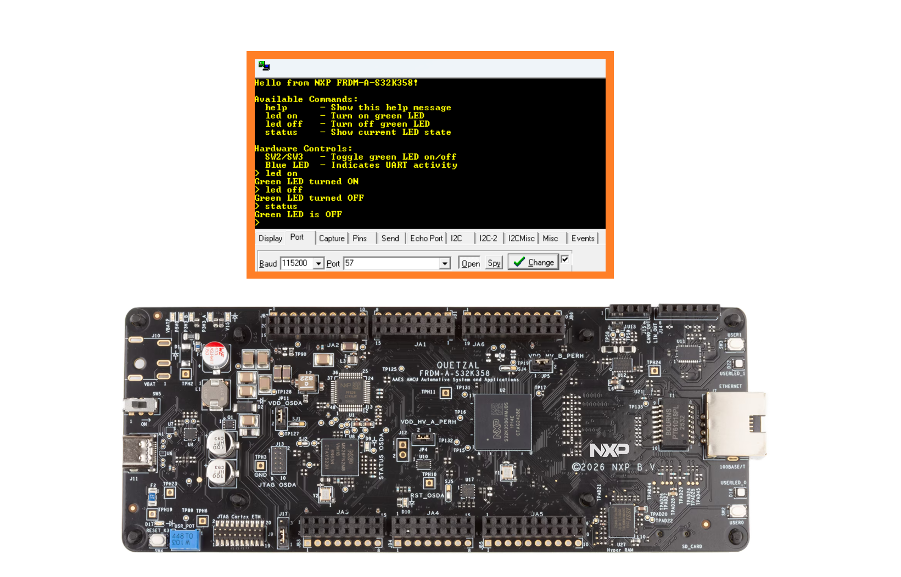
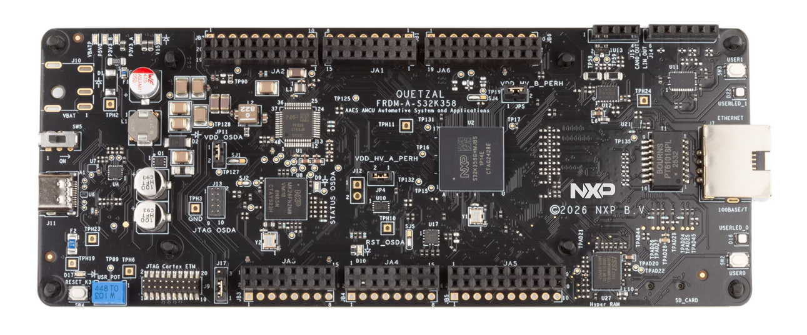
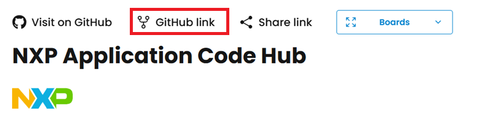
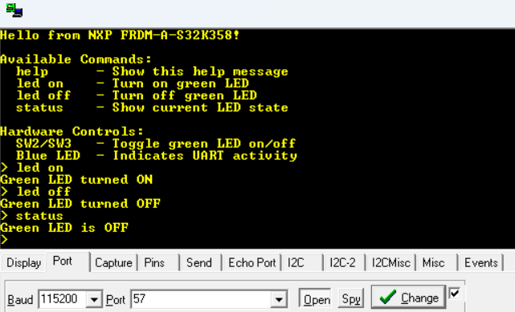

# NXP Application Code Hub

## Serial Terminal LED Control Using UART Driver
This application implements serial terminal control of the onboard LED using the RTD LPUART driver, allowing users to send commands and receive status feedback while demonstrating UART communication and GPIO interaction.
[

](./images/FRDM-A-S32K358-Button.png)

#### Boards: FRDM-A-S32K358
#### Categories: Communication, GPIO
#### Peripherals: LPUART, GPIO
#### Toolchains: S32 Design Studio IDE

## Table of Contents
1. [Software and Tools](#step1)
2. [Hardware](#step2)
3. [Setup](#step3)
4. [Results](#step4)
5. [Support](#step5)
6. [Release Notes](#step6)

## 1. Software and Tools
This example was developed using the FRDM Automotive Bundle for S32K3. To download and install the complete software and tools ecosystem, use the following link:
- [S32K3 FRDM Automotive Board Installation Package](https://www.nxp.com/app-autopackagemgr/automotive-software-package-manager:AUTO-SW-PACKAGE-MANAGER?currentTab=0&selectedDevices=S32K3&applicationVersionID=156)

## 2. Hardware
### 2.1 Required Hardware
- Personal Computer
- Type-C USB cable
- [FRDM-A-S32K358](https://www.nxp.com/design/design-center/development-boards-and-designs/FRDM-A-S32K358)
[

](./images/FRDM-A-S32K358.png)

### 2.2 Debugger Connection
- Connect the Type-C USB cable to PC and FRDM-A-S32K358 board for power supply and debugging

## 3. Setup

### 3.1 Import the Project into S32 Design Studio IDE
1. Open S32 Design Studio IDE, in the Dashboard Panel, choose **Import project from Application Code Hub**.
   [

](./images/import_project_1.png)

2. Find the demo by searching: [dm-uart-button-s32k358](https://mcuxpresso.nxp.com/appcodehub?search=dm-uart-button-s32k358)
3. Open the project, click the **GitHub link**, S32 Design Studio IDE will automatically retrieve project attributes, then click **Next>**.
    [

](./images/import_project_3.png)

4. Select **main** branch and then click **Next>**.

5. Select your local path for the repo in **Destination->Directory:** window. The S32 Design Studio IDE will clone the repo into this path, click **Next>**.

6. Select **Import existing Eclipse projects** then click **Next>**.

7. Select the project in this repo (only one project in this repo) then click **Finish**.

### 3.2 Generating, Building and Running the Example
1. In Project Explorer, right-click the project and select **Update Code and Build Project**. This will generate the configuration (Pins, Clocks, Peripherals), update the source code and build the project using the active configuration (e.g. Debug_FLASH).
Make sure the build completes successfully and the *.elf file is generated without errors.
[

](./images/update_and_build.png)
Press **Yes** in the **SDK Component Management** pop-up window to continue.

2. Go to **Debug** and select **Debug Configurations**. There will be a debug configuration for this project:
[

](./images/Debug_config.png)

        Configuration Name                  Description
        -------------------------------     -----------------------
        $(example)_debug_flash_pemicro      Debug the FLASH configuration using PEmicro probe

    Select the desired debug configuration and click on **Debug**. Now the perspective will change to the **Debug Perspective**.
    Use the controls to control the program flow.

## 4. Results
Open a serial terminal on the enumerated COM port (typical settings: 115200 baud, 8 data bits, no parity, 1 stop bit, no flow control).

Button control:
Onboard buttons control Green LED ON/OFF functionality (as defined by the board mapping)
The Blue LED indicates UART activity or command handling (for example, toggles briefly on RX/TX or on command parse).

Press enter to display the prompt, supported commands:
- Help – displays the list of available commands
- Led on – turns the Green LED on
- Led off – turns the Green LED off
- Status – prints the current Green LED state

[

](./images/FRDM-A-S32K358_UART.png)

## 5. Support
For general technical questions related to NXP microcontrollers, please use the *NXP Community Forum*.
#### Project Metadata

<!----- Boards ----->

<!----- Peripherals ----->

<!----- Toolchains ----->

Questions regarding the content/correctness of this example can be entered as Issues within this GitHub repository.

>**Note**: For more general technical questions regarding NXP Microcontrollers and the difference in expected functionality, enter your questions on the [NXP Community Forum](https://community.nxp.com/)

## 6. Release Notes
| Version | Description / Update                           | Date                        |
|:-------:|------------------------------------------------|----------------------------:|
| 1.0     | Initial release on Application Code Hub        | June 22th 2026   |
